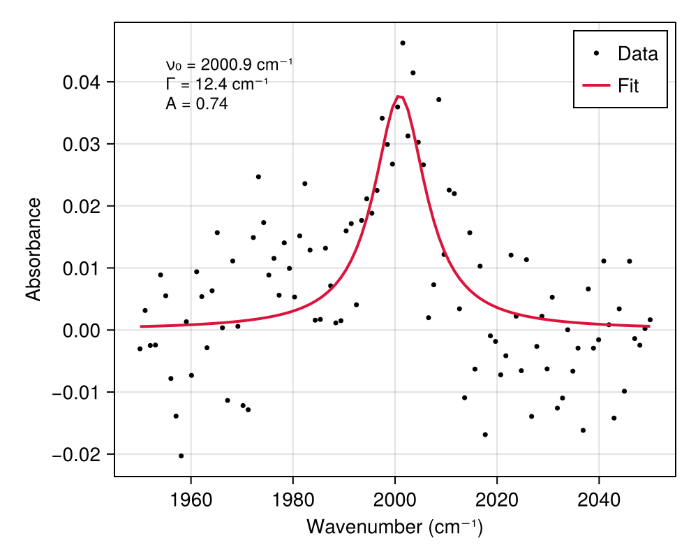

# CurveFitModels.jl

A Julia package containing model functions for curve fitting with [CurveFit.jl](https://github.com/SciML/CurveFit.jl).

All model functions follow the CurveFit.jl convention: `fn(parameters, x)` where parameters come first.

## Installation

Since this package is not registered, install it directly from GitHub:

```julia
using Pkg
Pkg.add(url="https://github.com/garrekstemo/CurveFitModels.jl")
```

## Example

Fit a Lorentzian to a molecular absorption peak:

```julia
using CurveFit
using CurveFitModels
using CairoMakie

# Simulated IR absorption peak near 2100 cm⁻¹ (e.g., C≡O stretch)
ν = range(2050, 2150, length=100)  # wavenumber (cm⁻¹)
true_params = [5.0, 2100.0, 12.0]  # [amplitude, center, FWHM]
y = lorentzian(true_params, ν) .+ 0.003 .* randn(length(ν))

# Fit with initial guess
p0 = [4.7, 2098.0, 15.0]  # initial guess for [A, ν₀, Γ]
prob = NonlinearCurveFitProblem(lorentzian, p0, ν, y)
sol = solve(prob)

# Extract fitted parameters
A, ν₀, Γ = sol.u
y_fit = lorentzian(sol.u, ν)

# Plot
fig = Figure(size=(500, 400))
ax = Axis(fig[1, 1], xlabel="Wavenumber (cm⁻¹)", ylabel="Absorbance")
scatter!(ax, ν, y, color=:black, markersize=5, label="Data")
lines!(ax, ν, y_fit, color=:crimson, linewidth=2, label="Fit")
axislegend(ax, position=:rt)

# Annotations
text!(ax, 2055, 0.035, text="ν₀ = $(round(ν₀, digits=1)) cm⁻¹\nΓ = $(round(Γ, digits=1)) cm⁻¹\nA = $(round(A, digits=2))", fontsize=12)

fig
```



## Parameters

Both `gaussian` and `lorentzian` use consistent parameterization:

| Parameter | Gaussian | Lorentzian |
|-----------|----------|------------|
| `A` | Peak amplitude | Peak amplitude |
| `x₀` | Center position | Center position |
| Width | `σ` (std dev) | `Γ` (FWHM) |
| `y₀` | Offset (optional) | Offset (optional) |

### Width Conversion

```julia
fwhm = sigma_to_fwhm(σ)   # Gaussian σ → FWHM
σ = fwhm_to_sigma(fwhm)   # FWHM → Gaussian σ
```

### Area Calculation

```julia
area = gaussian_area(A, σ)    # A × σ × √(2π)
area = lorentzian_area(A, Γ)  # A × π × Γ / 2
```

See the [CurveFit.jl documentation](https://github.com/SciML/CurveFit.jl) for more details on fitting.

